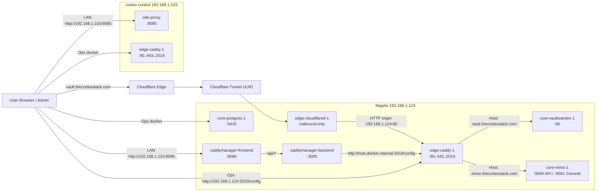
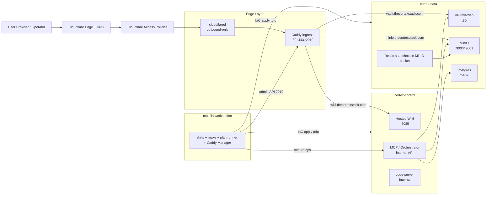

# Architecture Diagrams

## As-Built (Current)

## Future State (Target)

## Notes

- As-built diagram reflects the current active deployment pattern observed in February 2026.
- Future-state diagram reflects the planned control/data split documented in ADR-0003.
