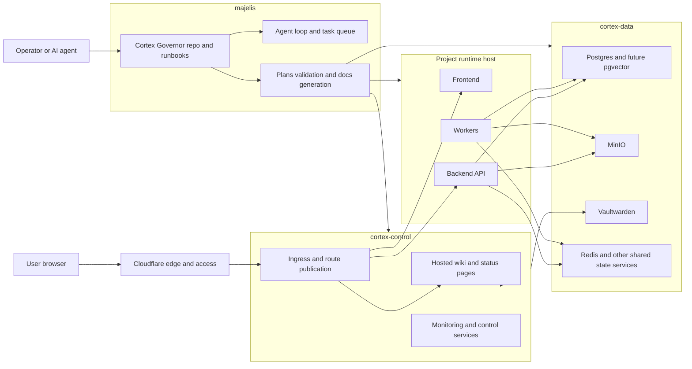

# Cortex Governor System Architecture Diagram

This is the canonical high-level system map for Cortex Governor.

It is intentionally role-centric rather than container-centric.

## Reading Guide

- `majelis` is the operator and development workstation.
- `cortex-control` is the control plane for ingress, wiki, and monitoring.
- `cortex-data` is the shared state and secret-bearing host.
- project runtime hosts are where application services should run.

## Scope Notes

- This diagram shows the intended stable platform model.
- It does not try to show every current container.
- Project-specific apps should not be added to the control-plane box by default.
