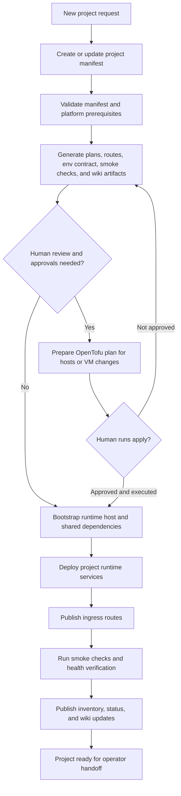

# Cortex Governor Project Onboarding Process

This is the canonical process diagram for how Cortex Governor should handle a new project.

It describes the supervised target workflow rather than a one-off historical sequence.

## Reading Guide

- Cortex Governor prepares and validates as much as possible before risky execution.
- Approval gates sit before destructive or infrastructure-changing steps.
- `apply` remains a human step under current governance.
- Wiki publication is part of the delivery workflow, not an afterthought.

## Current Versus Target

Current Cortex Governor already covers:

- manifest validation
- generated planning artifacts
- operator docs and wiki publication
- supervised queue execution

Target Cortex Governor should additionally cover:

- stronger host bootstrap automation
- project runtime deployment templates
- generated inventory from IaC and runtime facts
